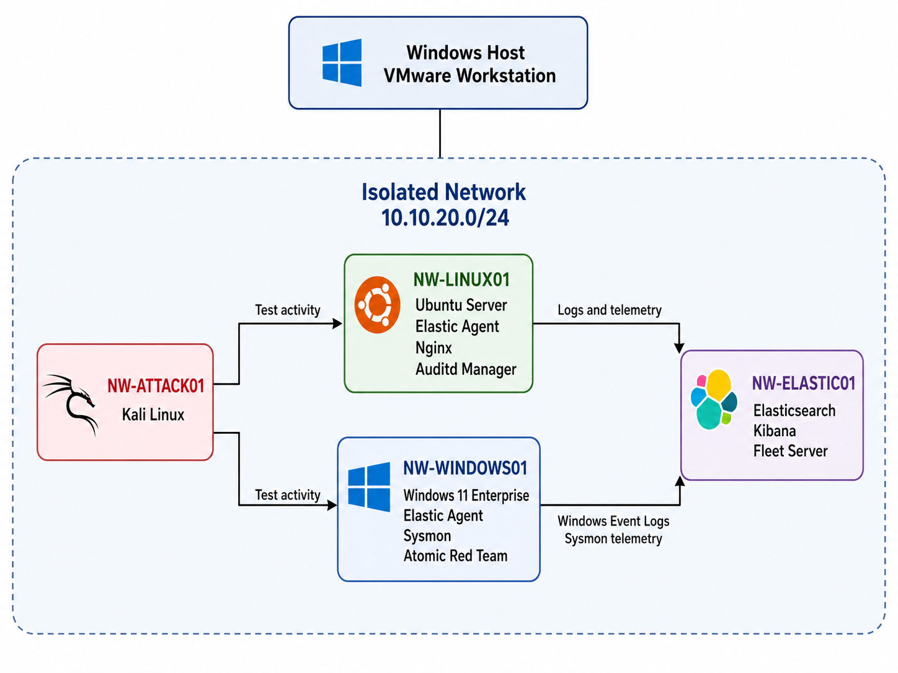

# SOC Home Lab 

This repository documents the development of a compact, self-hosted SOC lab built for hands-on learning. I use the environment to practice SOC operations and defensive security engineering while documenting the configuration, testing, troubleshooting, and lessons learned along the way.

This project is under active development.

## Project Goals 

The main goal is to build a small but complete security monitoring environment that is intended to support practice with: 

- SIEM administration 
- Linux and Windows security monitoring 
- Log and audit collection
- Alert investigation 
- Detection rule development, testing and tuning
- MITRE ATT&CK mapping  
- Linux hardening  

## Current Architecture

The virtual machines communicate over a dedicated VMware host-only network.
Bridged networking is disabled, and NAT is only used temporarily when software installation or updates require internet access.

## Current Implementation

- Elastic Security server running Elasticsearch, Kibana, and Fleet Server
- Ubuntu Server endpoint monitored with Elastic Agent
- Windows 11 Enterprise endpoint monitored with Elastic Agent
- Sysmon installed on the Windows endpoint for enhanced endpoint telemetry
- Linux authentication, audit, and system telemetry
- Kali Linux for security testing 
- Atmoic red team on the Windows endpoint

 
## Why These Choices Were Made 

Elastic was selected because it supports log collection, endpoint management, detection rules, alerting and investigation within the same environment.

Elasticsearch, Kibana, and Fleet Server run on one virtual machine to reduce memory usage. This is a practical choice for a laptop-based lab.

Ubuntu Server is used as the monitored endpoint because it provides access to Linux authentication logs, audit events, services, users, permissions and system configuration. 

Kali Linux is used only to generate controlled test activity inside the isolated network.

## Detection Engineering 

Detection development follows a simple workflow: 

1. Generate activity 
2. Confirm the activity in raw logs
3. Identify useful fields 
4. Create a detection rule 
5. Verify that the rule triggers
6. Investigate the generated alert
7. Tune and document the rule 

### Detection Rules 

Current detection work includes: 

- [Repeated Failed SSH Authentication](detections/linux/repeated-failed-ssh-authentication.md)
- [Successful SSH Login After Repeated Failures](detections/linux/successful-ssh-login-after-failures.md)
- [Linux User Added to sudo Group](detections/linux/user-added-to-sudo-group.md)
- [New Windows user added to administrators group](detections/windows/new-user-added-to-administrators-group.md)

## Lessons Learned So Far

- During testing, the Linux root filesystem became full, which prevented `rsyslog` from writing new authentication events. As a result, Elastic received no new `system.auth` logs and the detection rules stopped triggering. The issue was resolved by extending the logical volume.

- While building Windows detections, I learned that using SIDs can be more reliable than using account or group names. Names may differ between systems because of local configuration, while SIDs make it easier to identify the same user or known groups consistently.

## Roadmap 

- Develop and test Windows detection rules
- Build security monitoring dashboards in Kibana
- Continue developing and tuning Linux detection rules
- Improve Linux hardening 

## Disclaimer 

This is an educational home lab and is not intended to represent a production SOC deployment.
