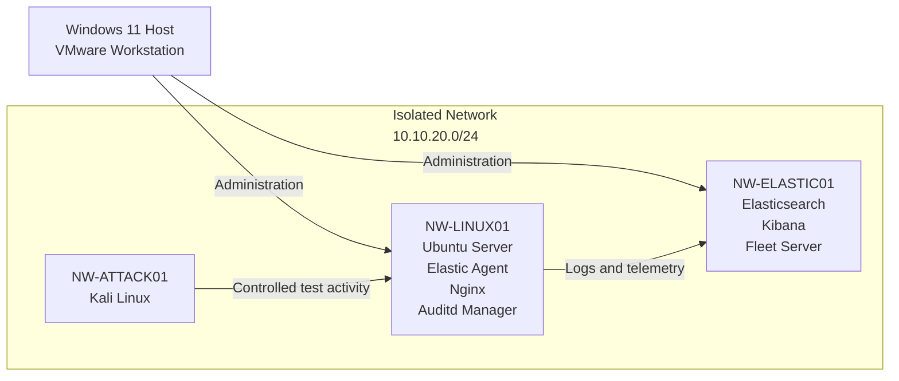

# SOC Home Lab 

This project is a compact, self-hosted SOC lab used to practice log collection, security monitoring, Linux hardening, detection engineering, and controlled attack simulations.

This project is under active development.

## Project Goals 

The main goal is to build a small but complete security monitoring environment that is intended to support practice with: 

* SIEM administration 
* Linux and Windows security monitoring 
* Log and audit collection
* Alert investigation 
* Detection rule development, testing and tuning
* MITRE ATT&CK mapping  
* Linux hardening 
* Simple firewall rules 

## Current Architecture

The virtual machines communicate over a dedicated VMware host-only network.

Bridged networking is disabled, and NAT is only used temporarily when software installation or updates require internet access.

## Current Implementation

- Elastic Security server 
- One monitored Ubuntu endpoint
- Kali Linux for testing 
- Linux logs and metrics 
- Nginx logs and metrics 
- Auditd telemetry
- Custom SSH detection rules  

## Why These Choices Were Made 

Elastic provides log collection, endpoint management, detection rules, alerting, and investigation in one platform without a daily ingestion license limit.

Elasticsearch, Kibana, and Fleet Server run on one virtual machine to reduce memory usage. This is a practical choice for a laptop-based lab.

Ubuntu Server is used as the monitored endpoint because it provides access to Linux authentication logs, audit events, services, users, permissions and system configuration. 

Kali Linux is used only to generate controlled test activity inside the isolated network.

## Detection Engineering 

Detection development follows a simple workflow: 

1. Generate activity 
2. Confirm the activity in raw logs
3. Identify useful fields 
4. Create detection rule 
5. Verify that the rule triggers
6. Investigate the generated alert
7. Tune and document the rule 

### Detection Rules 

Current detection work includes: 

- [Repeated Failed SSH Authentication](detections/linux/repeated-failed-ssh-authentication.md)
- [Successful SSH Login After Repeated Failures](detections/linux/successful-ssh-login-after-failures.md)
- [Linux User Added to Privileged Group](detections/linux/user-added-to-privileged-group.md)

## Lessons Learned So Far

During testing, the Linux root filesystem became full, which prevented `rsyslog` from writing new authentication events. As a result, Elastic received no new `system.auth` logs and the SSH detection stopped triggering. The issue was resolved by extending the LVM logical volume.

## Roadmap 

- Add a Windows endpoint
- Build security monitoring dashboards in Kibana
- Continue developing and testing detection rules
- Improve Linux hardening 
- Add controlled attack simulations with Atomic Red Team

## Disclaimer 

This is an educational home lab and is not intended to represent a production SOC deployment.
