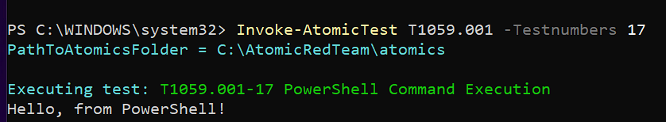
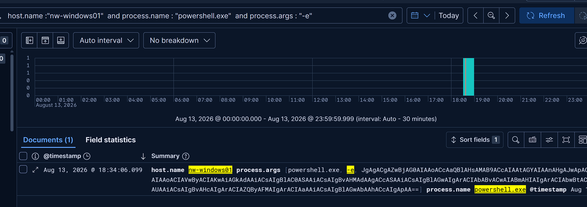

# Encoded Powershell Command Execution

Detects PowerShell processes launched with encoded command-line arguments.
Commonly used to obfuscate commands and may indicate suspicious or malicious script execution.

## Rule Summary

- **Status:** Experimental
- **Platform:** Windows 
- **Rule Type:** Custom query 
- **Severity:** Medium
- **MITRE ATT&CK:** 
    - TA0002 Execution 
        - T1059 Command and scripting interpreter
            - T1059.001 Powershell  

## Query

```kql
host.os.type: "windows" and
event.code: "1" and
process.name: "powershell.exe" and
process.args:("-e" or "-EncodedCommand" or "-enc")

```

## Logic 

```text
Powershell process is started
        ↓
Sysmon event id 1
        ↓
Commandline contains encoded powershell argument
        ↓
create medium severity alert 
```


## Atomic test 

The detection was validated using Atomic Red Team with technique T1059.001-17 Powershell command execution 



The activity was first confirmed in Elastic Discover using:

`host.name:"nw-windows01" and process.name:"powershell.exe" and process.args:"-e"`




## Possible false positives 

- Legitimate administrative PowerShell scripts using encoded commands
- Security testing and red team activity

