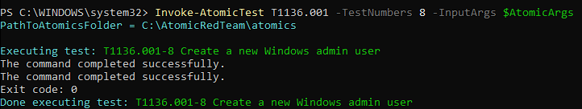

# New Windows user added to administrators group

Detects creation of a local Windows user followed by the same account being added to the local administrators group.

## Rule Summary

- **Status:** Experimental
- **Platform:** Windows 
- **Rule Type:** Correlation 
- **Severity:** High
- **MITR ATT&CK:**
    - TA0003 Persistence 
        - T1136 Create Account
            - T1136.001 Local Account
    - TA0004 Privilege Escalation
        - T1098 Account Manipulation
            - T1098.007 Additional Local or Domain Groups

## Query 

```eql
sequence by host.id with maxspan=10m
    [any where event.code == "4720"] 
     by user.target.id  

    [any where event.code == "4732" and
     group.id == "S-1-5-32-544"] 
     by winlog.event_data.MemberSid
```

## Logic

```text
Local user account is created
        ↓
Windows Event ID 4720
        ↓
Account is added to local Administrators
        ↓
Windows Event ID 4732
        ↓
Create a high severity alert 
```

##  Atomic test 

The detection was validated using Atomic Red Team with technique T1136.001-8 - Create a new Windows admin user. 




The rule matched the account creation followed by membership in the local Administrators group

## Possible false positives 

- Legitimate creation of local administrator accounts
- Authorizes Security testing 

## Limitations 

- Only detects accounts added to the local `Administrators` group
- The account creation and group membership change must occur within 10 minutes
- Does not detect an existing account that is later added to the group 